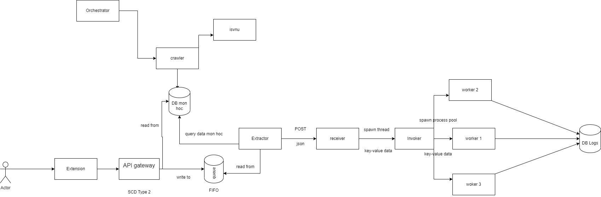

# DKMH

## Overall Architecture



## Project structure

- **config**: contains configuration files
- **crawler**: contains classes, classes' details crawlers, and a CDC process
- **db_migration**: contains databse creation and initial load
- **executor**: execute the registration processes
- **orchestrator**: contains Airflow DAGs that orchestrate the whole process
- **utils**: contains utility functions
- **testing**: contains unit tests

## Tech stack

- ***Flask***: for web server, REST API and registration processes.
- ***Python's Requests and BeautifulSoup***: for web crawling.
- ***PostgreSQL***: the database of choice.
- ***SQLAlchemy***: for database access and ORM - Object Relational Mapping.
- ***Airflow***: for orchestrating the whole process.
- ***Docker***: for containerization.

## Execution flow for Crawler

1. Create a virtual environment and install the dependencies.
2. Run the database migration scripts, including

> - Create the database schema.
>
> - Load the initial data.

3. CDC - Change Data Capture process is run prediodically to update the database with the latest data.

> - ***IF*** there is a new semester, the CDC process will load the new semester's data into the database and run the Classes and Class Details crawlers.
> - ***ELSE*** there is no new semester, the CDC ready to run for the next schedule.

## Manual execution flow

1. To create a virtual environment and install the dependencies, first clone the repo, cd into the directory and run:

```python3 -m venv/venv```

```source venv/bin/activate```

```pip install -r requirements.txt```

2. To run the database migration scripts, run:

```python db_migration/init_load.py```

3. To run the CDC process, run:

```python crawler/cdc.py```

4. To run the Classes and Class Details crawlers, run:

```python crawler/classes.py```
and

```python crawler/class_details.py```
