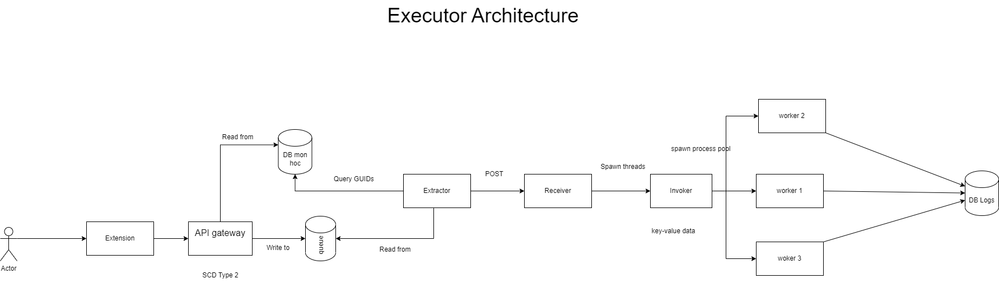

# DKMH

## Overall Architecture


## Project structure

- **config**: contains configuration files
- **crawler**: contains classes, classes' details crawlers, and a CDC process
- **db_migration**: contains databse creation and initial load
- **executor**: execute the registration processes
- **orchestrator**: contains Airflow DAGs that orchestrate the whole process
- **utils**: contains utility functions
- **testing**: contains unit tests

## Tech stack

- ***Flask***: for web server, REST API and registration processes.
- ***Python's Requests and BeautifulSoup***: for web crawling.
- ***PostgreSQL***: the database of choice.
- ***SQLAlchemy***: for database access and ORM - Object Relational Mapping.
- ***Airflow***: for orchestrating the whole process.
- ***Docker***: for containerization.

## Execution flow for Crawler

1. Create a virtual environment and install the dependencies.
2. Run the database migration scripts, including

> - Create the database schema.
>
> - Load the initial data.

3. CDC - Change Data Capture process is run prediodically to update the database with the latest data.

> - ***IF*** there is a new semester, the CDC process will load the new semester's data into the database and run the Classes and Class Details crawlers.
> - ***ELSE*** there is no new semester, the CDC ready to run for the next schedule.

## Manual execution flow for Crawler

1. To create a virtual environment and install the dependencies, first clone the repo, cd into the directory and run:

```python3 -m venv/venv```

```source venv/bin/activate```

```pip install -r requirements.txt```

2. To run the database migration scripts, run:

```python -m db_migration.init_load.py```

3. To run the CDC process, run:

```python -m crawler.cdc.py```

4. To run the Classes and Class Details crawlers, run:

```python -m crawler.classes.py```

```python -m crawler.class_details.py```

## Setting up prediodic execution for Crawler with Airflow with Docker

1. Set the path where you store the directory as the **HOME** environment variable
Ideally you should store the directory under the path: **${HOME}/projects/dkmh** as it is the volumes mapped inside Docker compose.

2. Setting up environment (Linux only, if you are runnng this on Windows or MacOs, you can safely skip this step), run:

``` mkdir -p ./dags ./logs ./plugins ```
``` echo -e "AIRFLOW_UID=$(id -u)" > .env ```

3. CD in to Orchestrator directory and run:

```docker compose up airflow-init```

4. After initialization is complete, you should see a message like this:

```
airflow-init_1       | Upgrades done
airflow-init_1       | Admin user airflow created
airflow-init_1       | 2.6.0
start_airflow-init_1 exited with code 0
```
The account created has the login **airflow** and the password **airflow**.

5. Go to Airflow Webserver at: http://localhost:8080/ and login with the account created.
After that, you should see the Airflow UI and all the DAGs.
Search for "orches_1" and turn it on.

## Execution flow for Executor



# The Executor will run as follow

1. Users will send a request though the Extension to register for a class - or a bunch of classes - classes will be chosen from the list of classes that are available for registration.

2. The Extension will check if the request is valid, and if User's credentials are valid.

3. User's data, including classes and credentials, will be saved to a queue.

4. At the time of Registration, the Extractor processes will processes the data from the queue - one by one - query all the matched GUIDs from the database, and send the requests to the Registration API - the Receiver.

5. The Receiver receives the requests, spawns coressponding threads and triggers the Invoker to execute the requests.

6. The Invoker spawns a process pool, and send them to the Workers to execute.

7. The Workers will execute the requests, and send the results back to Users and save the results to logs.
